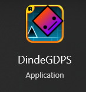
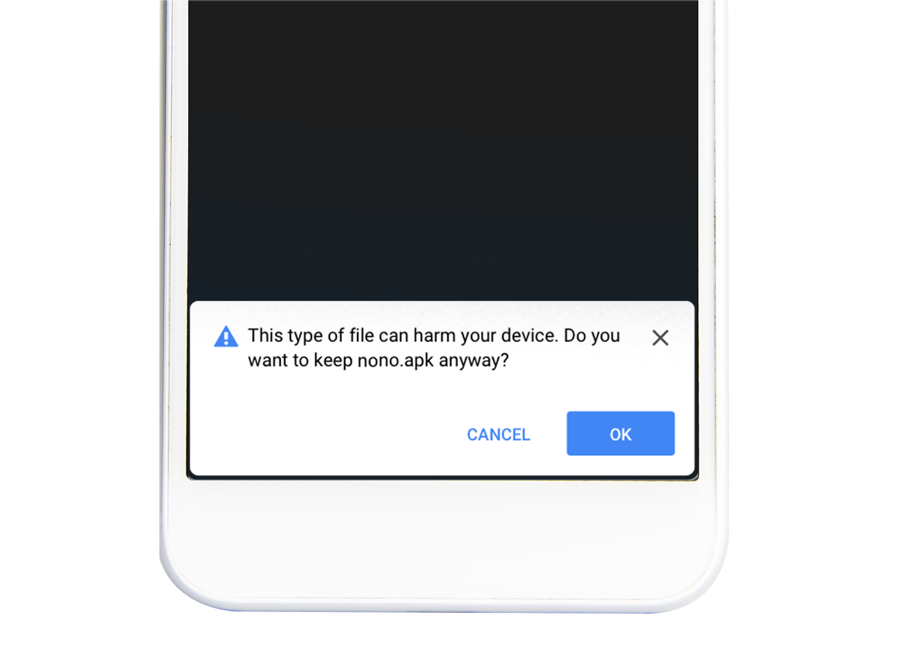

# Installation of DindeGDPS

## Windows (or WineHQ)
::: danger STOP
Support for Linux and MacOS with Wine hasn't been tested
:::

The installation is straightforward.
You just need to click [here](https://dl.dindegmdps.us.to/windows) to download the installation file and follow steps on the screen.
After this, a shortcut should be created or you can find the launcher from the search page.

##

## Android
::: tip Info
Geometry Dash doesn't support the latest versions of Android.
If you find any other issues, please contact us at : [contactus AT dimisaio.x10.mx](mailto:contactus@dimisaio.x10.mx)
:::

It is pretty easy for installing DindeGDPS on Android. Click [here](https://dl.dindegmdps.us.to/android) to download the latest version of the GDPS.

::: details "This file is dangerous"
You will need to click yes on the alert box if you see it. This will not harm your device.

:::

If you install an *apk* for the first time, a pop-up will show up saying installation is blocked.
Click the settings option and enable Untrusted Sources. Then, try again.
##

## iOS
### The easy way
::: warning
In iOS 16, you need to open Settings -> Privacy -> Developper Mode (all the way down).

Enable the option and follow next steps.
:::

Install [Altstore](https://altstore.io) alongside iCloud and iTunes. After installation, left click the tray icon and follow the steps to install Altstore on iOS. Finally, click on [this link](altstore://install?url=<URL_to_IPA>) to install DindeGDPS.

### The hard way (jailbreak)
| iOS Version  | Tools |
| ------------- | ------------- |
| Every version (iPhone X and lower, 32gb+)  | [checkra1n (14.8.1-)](https://ios.cfw.guide/installing-odysseyra1n/) or [palera1n (15.0+)](https://ios.cfw.guide/installing-palera1n/)  |
| 15.0 - 15.4.1  | [Trollstore](https://github.com/opa334/TrollStore/blob/main/install_trollhelperota_ios15.md)  |

I recommend checking [iOS.CFW.Guide](https://ios.cfw.guide/) for more info about jailbreaking.

If you installed TrollStore, click [here](apple-magnifier://install?url=<URL_to_IPA>)

If you installed a jailbreak, add [czrepo.fr.nf](https://czrepo.fr.nf) to your sources.
##